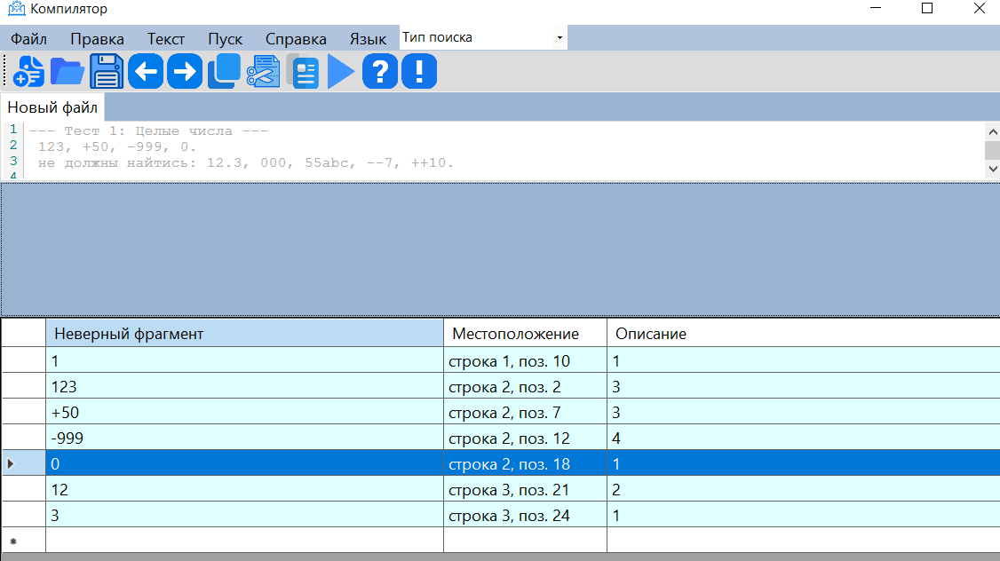
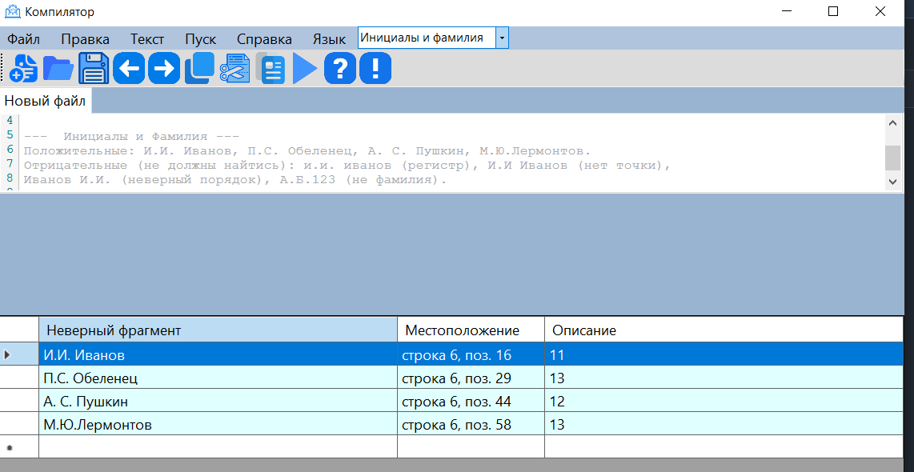
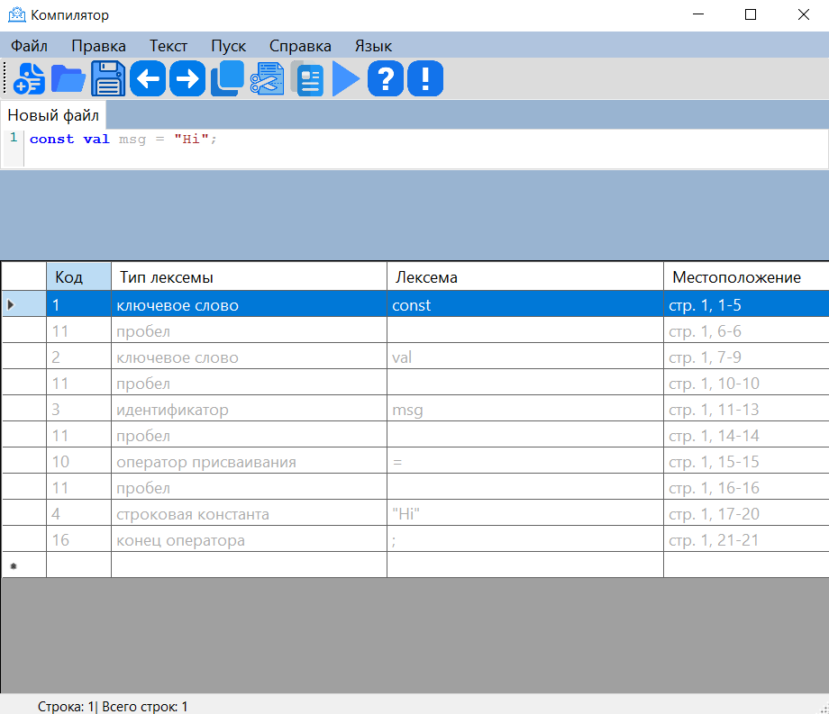
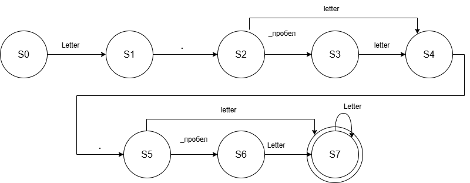
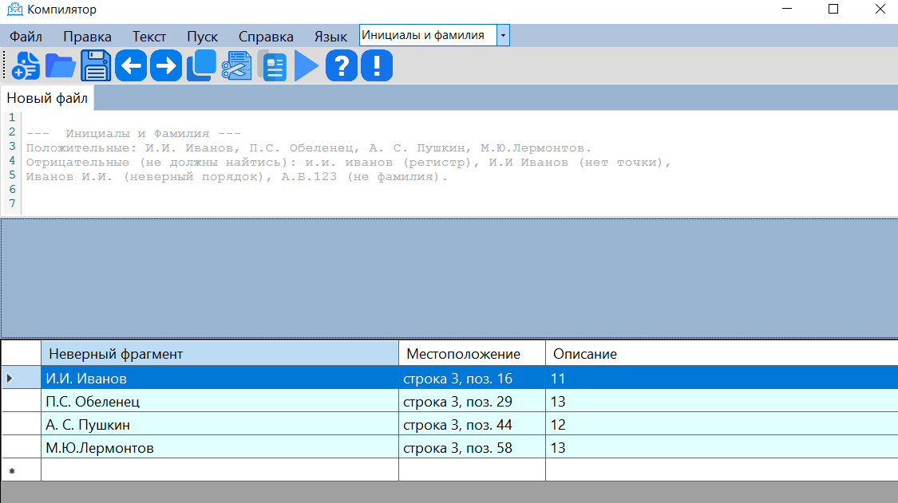

# Лабораторная работа 4. Реализация алгоритма поиска подстрок с помощью регулярных выражений

## Цель работы
Изучить теоретические основы регулярных выражений и их применение для поиска и извлечения подстрок из текста. Освоить практические навыки использования библиотечных средств работы с регулярными выражениями, а также интеграцию алгоритмов поиска в графический интерфейс приложения.
## Сведения об авторе
* **Автор:** Обеленец Павел
* **Группа:** АВТ-313
* **Год:** 2026

---
## Постановка задачи
Разработать модуль поиска подстрок с использованием регулярных выражений, интегрировать его в существующее приложение (текстовый редактор) и обеспечить наглядный вывод результатов.

### Вариант:
1) №4. Построить РВ, описывающее целое число (положительное или отрицательное)
2) №14. Построить РВ, описывающее инициалы и фамилию (И.О. Фамилия).
3) №27. Построить РВ для поиска HSL-кода цвета. Пример: hsl(120, 50%, 40%).

# Решение задач:

## 1. Поиск положительного или отрицательногоцелого числа
### a) Описание задачи;
Построить регулярное выражение (РВ), описывающее целое число. Число может иметь необязательный знак + или - и должно стоять отдельно от других слов или букв.
### b) Регулярное выражение с пояснением каждого обозначения.
```
(?<![\w+-])[+-]?(0|[1-9]\d*)(?![\w])

Описание:
(?<![\w+-]) — Negative Lookbehind (негативная ретроспективная проверка):
\w — запрещает, чтобы перед числом стояла буква, цифра или _.
+- — запрещает, чтобы перед числом стоял еще один плюс или минус (защита от --7 или ++10).
[+-]? — Квантификатор: один необязательный символ знака.
(0|[1-9]\d*) — Группировка и логическое ИЛИ:
0 — находит одиночный ноль.
| — оператор «ИЛИ».
[1-9]\d* — находит число, которое начинается с цифры от 1 до 9, после которой может идти любое количество цифр \d. Это исключает записи типа 00 или 08.
(?![\w]) — Negative Lookahead (негативная опережающая проверка):

Запрещает, чтобы после числа сразу шла буква, цифра или символ подчеркивания (чтобы не находить 12 в строке 12abc).
```
### c) Примеры строк, которые должны находиться;
--- Тест 1: Целые числа ---
 123, +50, -999, 0.
 не должны найтись: 12.3, 000, 55abc, --7, ++10.

```
123
+50
-999
0
```
### d) Примеры строк, которые не должны находиться;
```
000
55abc
--7
++10
```
### e) Тестовый пример:


## 2. Поиск инициалов и фамилии.
### a) Описание задачи;
Построить РВ, описывающее формат записи личных данных: две заглавные буквы с точками (инициалы) и фамилия, начинающаяся с заглавной буквы.
### b) Регулярное выражение с пояснением каждого обозначения.
```
[А-ЯЁ]\.\s?[А-ЯЁ]\.\s?[А-ЯЁ][а-яё]+

Описание:
[А-ЯЁ] — одна заглавная буква русского алфавита.
\. — символ точки (экранирован).
\s? — необязательный пробел (позволяет писать как И.О., так и И. О.).
[а-яё]+ — одна или более строчных букв фамилии.
```
### c) Примеры строк, которые должны находиться;
```
И.И. Иванов
П.В. Обеленец
А. С. Пушкин
М.Ю.Лермонтов.

```
### d) Примеры строк, которые не должны находиться;
```
и.и. иванов (регистр)
И.И Иванов (нет точки)
Иванов И.И. (неверный порядок)
А.Б.123 (не фамилия)
```
### e) Тестовый пример:


## 3. Поиск hsl кода
### a) Описание задачи;
Построить РВ для поиска формата цвета HSL (Hue, Saturation, Lightness). Пример: hsl(120, 50%, 40%)

### b) Регулярное выражение с пояснением каждого обозначения.
```
hsl\(\d{1,3},\s*\d{1,3}%,\s*\d{1,3}%\)

Описание:
hsl\( — буквальное совпадение текста "hsl(".
\d{1,3} — от 1 до 3 цифр (значение тона, насыщенности или яркости).
, — запятая.
\s* — любое количество пробелов (или их отсутствие).
% — символ процента.
\) — закрывающая скобка.
```
### c) Примеры строк, которые должны находиться;
```
hsl(120, 50%, 40%)
hsl(0,0%,100%)
hsl(360, 100%, 50%)
```
### d) Примеры строк, которые не должны находиться;
```
hsl(120, 50, 40)
rgb(120, 50, 40)
hsl(120%, 50%, 40%)
hsl(1000, 50%, 40%)
```
### e) Тестовый пример:


# Дополнительное задание: 
**Для задачи из 2 блока необходимо реализовать алгоритм поиска подстрок в тексте, перейдя к графу автомата.** 
### Задача - Поиск инициалов и фамилии.
## Граф автомата:

### Тестовый пример:

